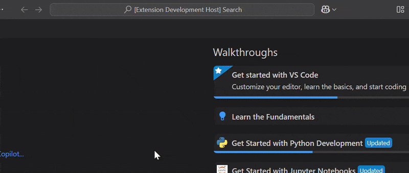

# Flutter Platforms Customizer: VS Code Extension


Easily create new Flutter projects with only the platforms you want—directly from Visual Studio Code!

## Features
- **Choose platforms**: Select from Android, iOS, Web, Windows, macOS, and Linux when creating a new Flutter project.
- **No manual cleanup**: Only the selected platforms are included in your project (using `flutter create --platforms`).
- **Simple UI**: Guided prompts for project name, location, and platforms.

## Getting Started

### 1. Install the Extension
- Clone or download this repository.
- Run `npm install` in the project root.
- Press `F5` in VS Code to launch an Extension Development Host.

### 2. Using the Extension
1. Open the Command Palette (`Ctrl+Shift+P` or `Cmd+Shift+P`).
2. Search for and run: `Flutter: New Project with Platforms`.
3. Enter your project name.
4. Select a folder for your new project.
5. Pick the platforms you want to support.
6. The extension will open a terminal and run the appropriate `flutter create` command for you.

## Requirements
- [Flutter SDK](https://flutter.dev/docs/get-started/install) installed and available in your system PATH.
- [VS Code](https://code.visualstudio.com/)
- [Dart & Flutter VS Code extensions](https://marketplace.visualstudio.com/items?itemName=Dart-Code.flutter) (recommended for Flutter development)

## Example


## Troubleshooting
- Make sure `flutter` is available in your terminal (try running `flutter --version`).
- If you see permission errors, ensure VS Code has access to the folder where you want to create the project.

## Contributing

We welcome contributions of all kinds! To get started:

1. **Fork this repository** and clone it to your local machine.
2. **Install dependencies**:
   ```sh
   npm install
   ```
3. **Open the project in VS Code**.
4. **Start the extension in development mode**:
   - Press `F5` to launch a new Extension Development Host window.
5. **Make your changes** in the `src/` directory.
6. **Lint and test your code**:
   - Run `npm run lint` to check for lint errors.
   - (Add tests in `test/` if applicable.)
7. **Submit a pull request** with a clear description of your changes.

### Guidelines
- Please keep your code clean and follow the existing style.
- Update documentation as needed.
- For major changes, open an issue first to discuss your idea.

Thank you for helping improve this project!

## License
[MIT](LICENSE)

---

**Happy Fluttering!**
